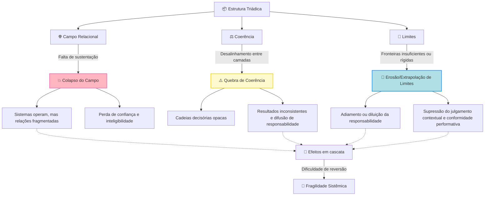
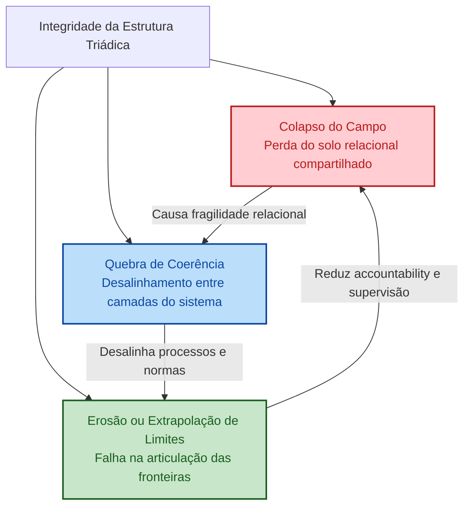
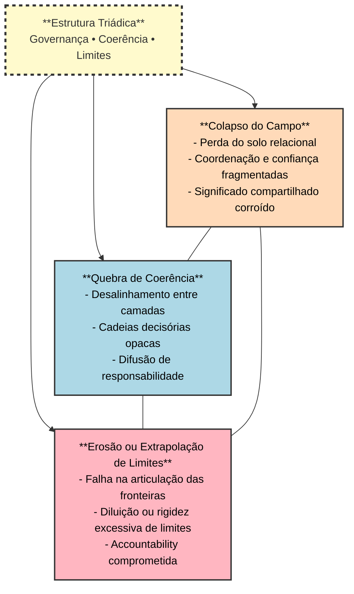
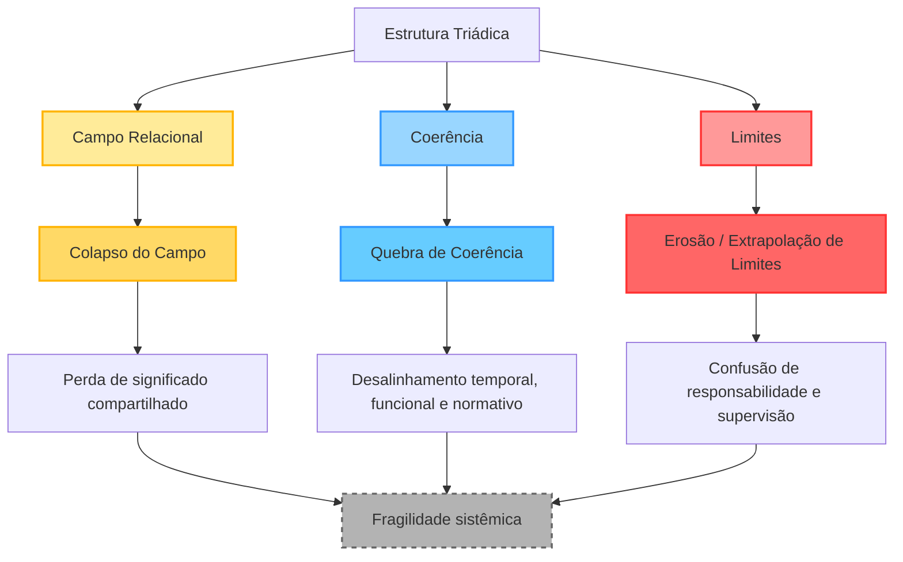
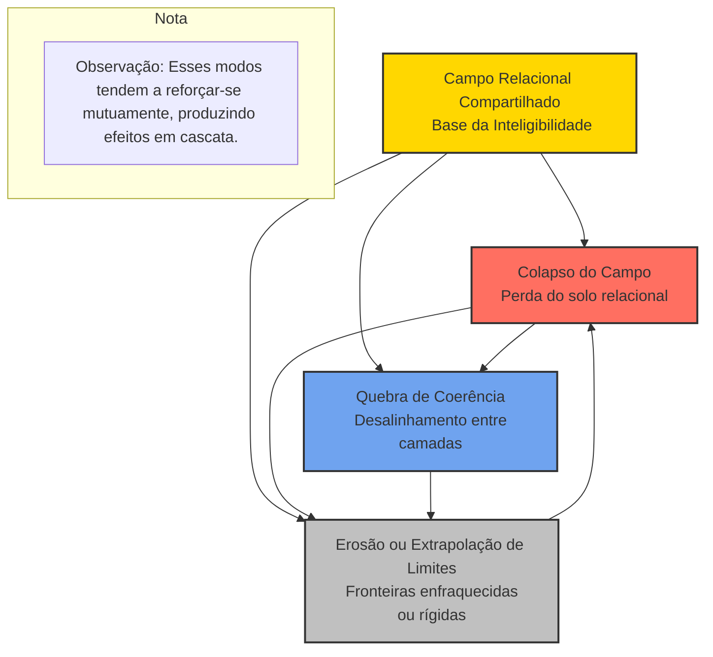

# 07 — A Estrutura Triádica da Coerência Relacional

Esta seção integra os conceitos previamente definidos de **Campo**, **Coerência** e **Limite** em um modelo estrutural unificado. Em vez de tratar esses conceitos como lentes analíticas independentes, propõe-se uma **estrutura triádica** na qual cada elemento é mutuamente constitutivo e necessário para a governabilidade sistêmica em sistemas híbridos humano–IA.

## 7.1 Fundamentação de um Modelo Triádico

A crescente complexidade dos sistemas híbridos humano–IA tem revelado limitações estruturais nos marcos analíticos e de governança predominantes. A maioria dos modelos existentes baseia-se em abordagens diádicas ou modulares que isolam interações, processos de otimização ou mecanismos de fronteira. Embora cada uma dessas perspectivas capture aspectos relevantes do comportamento sistêmico, nenhuma delas é suficiente para dar conta da governabilidade sob condições de elevada densidade relacional, acoplamento institucional e mediação algorítmica.

Modelos centrados na interação, comuns na pesquisa em sistemas sociotécnicos, tendem a focalizar agentes, interfaces e trocas informacionais. Quando desacoplados de uma noção explícita de **Campo**, esses modelos assumem implicitamente um substrato relacional neutro ou dado. Como resultado, têm dificuldade em explicar fenômenos como a erosão da confiança, a perda de significado compartilhado ou a fragmentação da construção coletiva de sentido — fenômenos que não emergem de interações discretas, mas de transformações no próprio ambiente relacional.

Em contraste, modelos de coerência baseados em otimização — prevalentes em alinhamento de IA, teoria de controle e governança orientada por desempenho — tratam a coerência principalmente como uma função de eficiência, consistência ou convergência em direção a objetivos predefinidos. Na ausência de um conceito explícito de **Limite**, essas abordagens correm o risco de produzir formas de coerência imposta que suprimem a pluralidade, obscurecem a responsabilidade e geram fragilidade sistêmica. A coerência, quando dissociada de limites articulados, pode tornar-se indistinguível de controle.

Estruturas de governança centradas em fronteiras, incluindo abordagens regulatórias e de conformidade, enfatizam limites, regras e restrições como instrumentos primários de controle. Embora indispensáveis, tais estruturas frequentemente operam sem uma compreensão estrutural da coerência relacional. Limites impostos sem consideração pelo campo relacional e por suas dinâmicas podem falhar em estabilizar o sistema ou, inversamente, desestabilizá-lo ao interromper coordenações informais, relações de confiança ou capacidades adaptativas.

O modelo triádico proposto neste artigo responde a essas limitações ao tratar **Campo**, **Coerência** e **Limite** como condições estruturais mutuamente constitutivas, e não como variáveis independentes. O **Campo** fornece o substrato relacional no qual as interações adquirem significado; a **Coerência** funciona como o processo dinâmico de alinhamento que sustenta a inteligibilidade entre camadas do sistema; e o **Limite** opera como a condição de fronteira que possibilita responsabilidade, diferenciação e estabilidade de longo prazo.

Argumenta-se que essa estrutura triádica representa uma condição mínima e irredutível para a sustentação da governabilidade em sistemas híbridos humano–IA. A remoção de qualquer um dos três elementos resulta em patologias sistêmicas: interação sem ancoragem, coerência coercitiva ou aplicação frágil de fronteiras. O modelo triádico oferece, assim, uma alternativa estruturalmente integrada às abordagens diádicas e modulares, capaz de enfrentar os desafios relacionais, normativos e operacionais colocados pelos sistemas híbridos contemporâneos.

## 7.2 Definições Estruturais e Papéis Sistêmicos

Esta subseção reposiciona **Campo**, **Coerência** e **Limite** não como propriedades isoladas, mas como **papéis estruturais** dentro de um sistema unificado.

### 7.2.1 Campo como Substrato Relacional

No modelo triádico proposto, *Campo* é compreendido como o **substrato relacional** que possibilita a emergência, a persistência e a transformação das relações dentro de um sistema. Ele não é um contêiner de fundo no qual as interações simplesmente ocorrem, mas uma **condição constitutiva** que molda quais tipos de relações são possíveis, inteligíveis e sustentáveis.

O campo precede as interações discretas em um sentido estrutural. Agentes — humanos, artificiais ou institucionais — não se relacionam no vazio; suas interações estão sempre já condicionadas por um ambiente relacional compartilhado que carrega expectativas, normas, affordances e assimetrias. Esse ambiente é o que designamos como campo. Sem um conceito articulado de campo, as dinâmicas relacionais são reduzidas a trocas isoladas, obscurecendo os padrões sistêmicos por meio dos quais significado, confiança e coordenação emergem.

De forma crucial, o campo não é redutível à soma de agentes, interfaces ou fluxos de dados. Embora seja instanciado por esses elementos, ele não pode ser plenamente descrito por eles. Infraestruturas de dados, protocolos de comunicação, organogramas institucionais e interfaces algorítmicas participam da conformação do campo, mas não esgotam sua estrutura. O campo inclui normas informais, expectativas tácitas, relações de poder, ritmos temporais e quadros interpretativos compartilhados que operam através e entre os componentes formais do sistema.

Em sistemas híbridos humano–IA, o campo relacional é moldado dinamicamente pela interação entre arranjos institucionais, arquiteturas tecnológicas e práticas humanas. Políticas institucionais e estruturas de governança contribuem para definir formas legítimas de ação e responsabilidade; sistemas tecnológicos modulam visibilidade, velocidade e escala das interações; e os atores humanos adaptam-se continuamente, resistem ou reinterpretam tanto as restrições institucionais quanto as tecnológicas. O campo, assim, evolui ao longo do tempo, muitas vezes de maneiras apenas parcialmente legíveis para projetistas de sistemas ou reguladores.

Compreender o campo como substrato relacional permite explicar fenômenos sistêmicos que não podem ser compreendidos apenas a partir do comportamento em nível de agente, como a perda de construção coletiva de sentido, a normalização de processos decisórios opacos ou a erosão gradual da accountability. No interior da estrutura triádica, o campo fornece o terreno sobre o qual a coerência pode emergir e dentro do qual os limites adquirem significado. Sem sensibilidade ao campo, tentativas de engenheirar coerência ou impor limites correm o risco de operar sobre um sistema abstraído, que já não corresponde à realidade relacional vivida dos ambientes híbridos humano–IA.

### 7.2.2 Coerência como Processo Sistêmico de Alinhamento

Neste modelo, a **Coerência** é definida não como um estado estático de equilíbrio ou otimização, mas como um **processo dinâmico e contínuo de alinhamento** entre múltiplas dimensões de um sistema. Em vez de se referir apenas à consistência interna, a coerência descreve a capacidade do sistema de sustentar uma integração relacional significativa ao longo do tempo, mantendo-se responsivo às variações contextuais.

Em primeiro lugar, a coerência é inerentemente **temporal**. Sistemas híbridos humano–IA operam em escalas de tempo heterogêneas: a deliberação humana, os procedimentos institucionais e os processos computacionais evoluem em velocidades e ritmos distintos. A coerência emerge quando essas camadas temporais estão suficientemente alinhadas para que ações, decisões e ciclos de retroalimentação permaneçam mutuamente inteligíveis. A incoerência temporal — como quando ações automatizadas superam a supervisão humana ou a capacidade de resposta institucional — produz rupturas na accountability e na confiança.

Em segundo lugar, a coerência é **funcional**. Ela requer alinhamento entre papéis, responsabilidades e lógicas operacionais dos diferentes componentes do sistema. Em sistemas híbridos, isso inclui humanos, artefatos técnicos, algoritmos, interfaces e arcabouços institucionais. A incoerência funcional surge quando objetivos de otimização, critérios decisórios ou mecanismos de controle entram em conflito entre camadas do sistema, resultando em fragmentação da agência ou em efeitos sistêmicos não intencionais.

Em terceiro lugar, a coerência é **normativa**. Sistemas não são neutros em valores: eles incorporam pressupostos sobre responsabilidade, legitimidade, equidade e níveis aceitáveis de risco. A coerência normativa refere-se ao alinhamento entre valores declarados, regras implementadas e o comportamento efetivo do sistema. Quando compromissos normativos se dissociam da realidade operacional — como no caso de princípios éticos sem mecanismos de aplicação — a coerência se deteriora, mesmo que o sistema permaneça tecnicamente funcional.

Ao atravessar essas dimensões, a coerência desempenha um papel central na sustentação da **inteligibilidade** em sistemas híbridos. Inteligibilidade refere-se à capacidade dos participantes do sistema de compreender como decisões são tomadas, como ações se propagam e onde a responsabilidade se localiza. Sem coerência suficiente, sistemas podem continuar operando enquanto se tornam opacos, imprevisíveis ou socialmente ilegíveis.

Por fim, a coerência é uma **condição prévia da confiança**. A confiança não emerge apenas do desempenho, mas da confiabilidade percebida e da interpretabilidade dos processos relacionais ao longo do tempo. Em sistemas híbridos humano–IA, a coerência sustenta a confiança ao estabilizar expectativas, esclarecer fronteiras de agência e manter continuidade entre intenção, ação e resultado.

Nesse sentido, a coerência não é um objetivo opcional de otimização, mas um **requisito estrutural** para a governabilidade e a sustentabilidade de sistemas relacionais complexos.

### 7.2.3 Limite como Condição Estrutural de Fronteira

No modelo triádico proposto, *Limite* não é compreendido como uma mera restrição imposta ao comportamento do sistema, mas como uma **condição estrutural generativa** que possibilita agência, responsabilidade e estabilidade relacional. Os limites definem os contornos dentro dos quais a interação coerente se torna possível, prevenindo tanto a expansão descontrolada quanto a ambiguidade sistêmica.

Como restrição generativa, o limite opera moldando o espaço de ações possíveis, e não proibindo a ação de forma absoluta. Em sistemas complexos, a ausência de limites bem articulados não produz liberdade, mas indeterminação, difusão de responsabilidade e perda de governabilidade. Em contraste, limites adequadamente definidos permitem a diferenciação de papéis, a clarificação da autoridade e a emergência de agência responsável entre os componentes do sistema.

Os limites são, portanto, essenciais para a responsabilidade e a accountability. Em sistemas híbridos humano–IA, as ações distribuem-se entre atores humanos, sistemas técnicos e estruturas institucionais. Sem condições de fronteira claras, torna-se impossível atribuir responsabilidade por decisões, erros ou danos. Os limites estabelecem quem pode agir, sob quais condições e com quais formas de supervisão, sustentando assim a inteligibilidade ética e jurídica do sistema.

Além disso, os limites são necessários para a **diferenciação de agência**. A agência humana, a agência institucional e a agência automatizada ou algorítmica operam segundo lógicas e capacidades distintas. Tratar essas formas de agência como intercambiáveis ou indistintas conduz a falhas de governança, incluindo a sobreautomação, a terceirização moral e a atribuição injusta de culpa. Limites estruturais preservam a especificidade de cada forma de agência, ao mesmo tempo em que possibilitam a interação coordenada dentro do sistema.

Uma distinção crucial deve ser estabelecida entre **limites explícitos** e **limites implícitos**. Limites explícitos incluem restrições formalmente articuladas, como políticas, regulações, protocolos técnicos, controles de acesso e regras procedimentais. Esses limites são codificados, inspecionáveis e frequentemente aplicáveis por meio de mecanismos institucionais.

Limites implícitos, por sua vez, emergem de condições cognitivas, institucionais e éticas. Limites cognitivos dizem respeito à atenção humana, à compreensão e à capacidade decisória. Limites institucionais derivam de estruturas organizacionais, normas culturais e práticas históricas. Limites éticos refletem valores compartilhados, intuições morais e fronteiras socialmente negociadas do que é considerado aceitável. Embora menos visíveis, os limites implícitos exercem profunda influência sobre o comportamento do sistema e frequentemente determinam se os limites explícitos serão eficazes ou meramente simbólicos.

A incoerência estrutural surge quando limites explícitos e implícitos estão desalinhados — por exemplo, quando estruturas formais de governança excedem a capacidade cognitiva humana, ou quando expectativas éticas não encontram suporte no desenho institucional. Nesses casos, os limites podem existir nominalmente sem funcionar como condições estabilizadoras de fronteira.

No modelo triádico, o **Limite** opera em relação contínua com **Campo** e **Coerência**. Os limites moldam a topologia do campo relacional e estabilizam a coerência ao longo do tempo, enquanto a coerência assegura que os limites permaneçam inteligíveis e legítimos dentro do campo. Em conjunto, essas interações posicionam o limite não como um obstáculo ao desempenho sistêmico, mas como uma **condição fundacional para sistemas híbridos sustentáveis, responsáveis e governáveis**.

## 7.3 Dinâmicas Relacionais no Interior da Tríade

Embora **Campo**, **Coerência** e **Limite** possam ser distinguidos analiticamente, sua significação emerge apenas por meio de sua **interação dinâmica**. A estrutura triádica proposta neste artigo não é estática nem hierárquica; ela é **relacional e processual**. Cada componente molda continuamente e é moldado pelos outros, gerando padrões sistêmicos de estabilidade, adaptação ou colapso.

Esta subseção formaliza essas dinâmicas relacionais por meio do exame das **três interações diádicas primárias** no interior da tríade.

### 7.3.1 Interação Campo–Coerência

O campo relacional condiciona as formas de coerência que podem emergir em um sistema. Como o campo define quais relações são possíveis, inteligíveis e legítimas, ele estabelece as **pré-condições estruturais** para os processos de alinhamento entre os componentes do sistema. A coerência não surge independentemente do campo; ela é sempre coerência *dentro* de uma topologia relacional específica.

Em campos caracterizados por **alta densidade relacional** — nos quais as interações são frequentes, mediadas por múltiplas camadas e institucionalmente entrelaçadas — a coerência exige negociação contínua e recalibração constante. O alinhamento, nesses contextos, é inerentemente frágil: pequenas alterações em normas, interfaces ou assimetrias de poder podem se propagar amplamente, produzindo efeitos sistêmicos que excedem interações localizadas. Em contraste, campos esparsos ou fracamente articulados podem falhar em sustentar a coerência por completo, uma vez que os participantes carecem de quadros de referência compartilhados necessários à inteligibilidade mútua.

A interação entre campo e coerência é mediada por **ciclos de retroalimentação**. À medida que a coerência estabiliza expectativas e molduras interpretativas, ela reforça a própria estrutura do campo, tornando algumas relações mais duráveis e outras menos salientes. Ao mesmo tempo, transformações no campo — como a introdução de sistemas decisórios mediados por IA, reformas institucionais ou mudanças nos padrões de participação — podem desestabilizar padrões de coerência existentes. Nesse sentido, a coerência tanto depende do campo quanto o remodela ativamente.

De forma crucial, tentativas de **engenharia da coerência** que desconsideram o campo relacional frequentemente resultam em alinhamentos superficiais ou frágeis. Por exemplo, a padronização algorítmica pode produzir uma consistência aparente nos resultados, ao mesmo tempo em que oculta incoerências profundas nos níveis de significado, responsabilidade ou confiança. A sensibilidade à interação campo–coerência é, portanto, essencial para distinguir entre um alinhamento sistêmico genuíno e formas de coerência meramente formais, impostas ou estruturalmente frágeis.

### 7.3.2 Interação Coerência–Limite

Os **limites** desempenham um papel crítico na estabilização da coerência ao impedir que os processos de alinhamento colapsem em rigidez ou extrapolação excessiva. A coerência, quando não tensionada por condições de fronteira adequadas, pode tornar-se **autorreferente**, suprimindo pluralidade, adaptabilidade e contestação crítica. Nesses casos, ela deixa de operar como um processo relacional integrador e passa a funcionar como um **mecanismo de controle**.

Limites bem articulados atuam como **estabilizadores** que preservam a abertura da coerência. Ao definir fronteiras de autoridade, escopo de ação e condições de exceção ou revisão, os limites asseguram que a coerência permaneça responsiva, e não totalizante. Eles permitem que os sistemas mantenham alinhamento ao mesmo tempo em que acomodam diversidade de perspectivas, variação contextual e dissenso ético legítimo.

Por outro lado, limites insuficientes ou mal definidos comprometem a coerência. A **sub-limitação** conduz à fragmentação, pois os processos de alinhamento carecem de condições de ancoragem para a responsabilidade e a tomada de decisão. Em sistemas híbridos humano–IA, isso frequentemente se manifesta como **difusão de agência**: processos automatizados operam sem supervisão clara, enquanto atores humanos perdem a capacidade de intervir de forma significativa devido à opacidade, à escala ou à velocidade do sistema.

A interação entre **Coerência** e **Limite** envolve, portanto, um **equilíbrio contínuo**. A sobre-coerência produz rigidez, dependência de trajetória e supressão de interpretações alternativas; a sub-limitação gera instabilidade, ambiguidade e perda de governabilidade. Sistemas sustentáveis requerem limites que não sejam meramente restritivos nem apenas simbólicos, mas **estruturalmente integrados aos próprios processos de coerência que sustentam a governabilidade do sistema.**

### 7.3.3 Interação Campo–Limite

Os **limites** não são impostos sobre um substrato neutro; eles são **instituídos no interior do campo relacional** e, ao fazê-lo, passam a **reconfigurá-lo ativamente**. O estabelecimento de fronteiras é, portanto, um ato relacional, e não uma intervenção puramente técnica ou jurídica. A eficácia dos limites depende de como são interpretados, internalizados e negociados no interior do campo.

Quando os limites estão **bem alinhados ao campo relacional**, eles clarificam expectativas, reforçam formas legítimas de autoridade e fortalecem a confiança. Limites institucionais transparentes sobre decisões automatizadas, por exemplo, podem estabilizar as relações humano–IA ao tornar **inteligíveis** o escopo, as condições e as consequências da ação algorítmica para os participantes afetados. Nesses casos, os limites contribuem para a **legibilidade do campo** e para a previsibilidade relacional.

Em contraste, limites **desalinhados do campo** tendem a falhar em sua função estabilizadora ou a gerar efeitos não intencionais. Restrições formais que ignoram práticas informais, dinâmicas de poder ou condições cognitivas concretas podem ser contornadas, ignoradas ou aplicadas seletivamente. Esse descompasso favorece o surgimento de **práticas paralelas ou opacas**, que desestabilizam ainda mais o campo e corroem tanto a coerência quanto a accountability.

Os **limites institucionais** são particularmente relevantes como mecanismos de configuração do campo. Políticas, regulações e arranjos de governança não apenas restringem comportamentos, mas **sinalizam prioridades normativas** e redistribuem poder relacional. Em sistemas híbridos, tais limites definem como os sistemas de IA são posicionados no campo — como ferramentas, agentes, assessores ou autoridades — moldando, assim, toda a topologia relacional.

No interior da estrutura triádica, a interação **Campo–Limite** assegura que as fronteiras permaneçam significativas e operantes, contribuindo para a estabilidade relacional e evitando formas abstratas ou ineficazes de limitação. Os limites adquirem legitimidade apenas na medida em que ressoam com as condições relacionais vividas no sistema. Ao mesmo tempo, sua articulação pode transformar o campo ao redefinir papéis, responsabilidades e modos de participação. Essa co-constituição evidencia por que os limites não podem ser tratados como restrições externas, mas devem ser compreendidos como **componentes integrais do desenho relacional de sistemas governáveis**.

## 7.4 Condições de Estabilidade e Ruptura

A análise das interações diádicas na subseção anterior evidencia que Campo, Coerência e Limite operam sempre de forma interdependente e dinâmica. No entanto, a mera existência dessas interações não garante a sustentabilidade do sistema ao longo do tempo. Esta subseção desloca, portanto, o foco das dinâmicas relacionais para as condições estruturais sob as quais essas dinâmicas permanecem estáveis — ou, alternativamente, entram em ruptura.

Esta subseção identifica as condições sob as quais a estrutura triádica se sustenta ou colapsa.

### 7.4.1 Condições de Estabilidade Estrutural

A estabilidade da estrutura triádica depende de um conjunto de condições **necessárias — embora não suficientes** — que permitem que **Campo**, **Coerência** e **Limite** permaneçam mutuamente reforçadores ao longo do tempo. Estabilidade estrutural não implica estase nem ausência de conflito; ela designa, antes, a **capacidade do sistema de absorver variação, contestação e mudança** sem perder governabilidade ou inteligibilidade relacional. Três condições interdependentes são particularmente críticas: **limiares mínimos de coerência**, **articulação adequada de limites** e **transparência e legibilidade do campo**.

**Limiares mínimos de coerência.**
Para que um sistema híbrido humano–IA permaneça governável, a coerência deve ultrapassar um limiar mínimo nas dimensões temporal, funcional e normativa. Abaixo desse limiar, os componentes do sistema podem continuar operando localmente, mas o sistema como um todo torna-se **ininteligível e não responsabilizável**.

Coerência mínima não requer alinhamento total nem consenso pleno. Ela exige, antes, integração suficiente para que os participantes do sistema possam: (a) compreender como as ações se propagam entre camadas, (b) antecipar as consequências de intervenções e (c) localizar responsabilidades por decisões e resultados. Quando esse limiar não é alcançado, surgem cadeias decisórias opacas, lógicas operacionais conflitantes e erosão da confiança — mesmo em sistemas que permanecem tecnicamente funcionais.

Esses limiares são **dependentes do contexto**. Domínios de alto impacto, como saúde, administração pública ou sistemas judiciais, demandam níveis mais elevados de coerência do que ambientes exploratórios ou de baixo risco. A estabilidade estrutural, portanto, não exige coerência máxima, mas **coerência calibrada às condições sociais, éticas e institucionais do sistema**.

**Articulação adequada de limites.**
A estabilidade estrutural também depende da presença de limites que sejam **claramente articulados, operacionalmente aplicáveis e inteligíveis no interior do campo relacional**. Os limites devem definir, de forma consistente, escopos de autoridade, condições de ação e mecanismos de accountability entre componentes humanos, institucionais e técnicos.

Limites mal articulados — seja por excessiva vagueza, complexidade desnecessária ou desalinhamento com as práticas efetivas do sistema — falham como condições estabilizadoras. Essas falhas tendem a produzir dois efeitos recorrentes: a **erosão dos limites**, quando fronteiras existem apenas formalmente, ou a **hipertrofia normativa**, quando restrições se acumulam sem integração real aos processos do sistema.

A articulação adequada de limites requer coerência entre limites explícitos e implícitos. Regras formais, políticas institucionais e constrangimentos técnicos devem ser compatíveis com capacidades cognitivas humanas, rotinas organizacionais e expectativas éticas compartilhadas. Quando essa compatibilidade não se estabelece, os limites tornam-se simbólicos ou performativos, enfraquecendo tanto a coerência quanto a legitimidade do sistema. A estabilidade não decorre da mera existência de limites, mas de sua **integração estrutural aos processos relacionais**.

**Transparência e legibilidade do campo.**
A terceira condição de estabilidade diz respeito ao grau de **transparência e legibilidade do próprio campo relacional**. Transparência do campo refere-se à visibilidade das estruturas de relação — papéis, dependências, trajetórias decisórias e assimetrias de poder. Legibilidade, por sua vez, diz respeito à capacidade dos participantes de **interpretar essas estruturas e orientar suas ações de forma informada**.

Campos opacos ou pouco legíveis comprometem a estabilidade mesmo quando coerência e limites estão formalmente presentes. Os participantes podem cumprir regras ou interagir com sistemas sem compreender como os resultados são produzidos ou como as responsabilidades estão distribuídas. Nesses contextos, a confiança torna-se frágil, a contestação se distorce e os mecanismos corretivos deixam de operar.

Em sistemas híbridos humano–IA, a opacidade do campo é frequentemente amplificada pela mediação algorítmica, pela escala e pela velocidade dos processos automatizados. Cadeias causais tornam-se difíceis de rastrear, enquanto a sobreposição institucional difunde a accountability. A estabilidade estrutural exige, portanto, esforços deliberados para tornar o campo **suficientemente legível**, por meio de práticas de transparência, interpretabilidade, governança participativa e supervisão reflexiva.

É crucial notar que transparência do campo não implica visibilidade total nem divulgação irrestrita. Ela requer, antes, que a estrutura relacional seja **inteligível o bastante** para sustentar participação informada, supervisão significativa e intervenção responsável. A opacidade excessiva desestabiliza a estrutura triádica ao dissociar a coerência da experiência relacional vivida e ao tornar os limites abstratos ou inaplicáveis.

Em conjunto, essas três condições delineiam os **requisitos estruturais mínimos** para a sustentação do modelo triádico. Quando os limiares mínimos de coerência são atingidos, os limites estão adequadamente articulados e o campo permanece transparente e legível, sistemas híbridos humano–IA preservam sua capacidade de governança adaptativa. Quando uma ou mais dessas condições falham, o sistema torna-se vulnerável aos modos de ruptura analisados na subseção seguinte.

### 7.4.2 Modos de Ruptura

Quando as condições de estabilidade estrutural delineadas na Seção 7.4.1 não são sustentadas, a estrutura triádica torna-se vulnerável a **modos distintos de ruptura**. Essas rupturas não devem ser compreendidas como falhas imediatas do sistema ou como colapsos funcionais abruptos. Elas emergem, antes, como **processos graduais, relacionais e sistêmicos**, por meio dos quais governabilidade, inteligibilidade e accountability são progressivamente corroídas. Esta subseção examina três modos primários de ruptura — **colapso do campo**, **quebra de coerência** e **erosão ou extrapolação de limites** — cada um correspondendo diretamente à falha de um dos elementos da estrutura triádica.

**Colapso do campo (perda do solo relacional compartilhado).**
O colapso do campo ocorre quando o substrato relacional que possibilita significado compartilhado, expectativas comuns e orientação mútua deixa de ser sustentado. Nessa condição, os atores continuam interagindo no interior do sistema, mas já não o fazem a partir de um solo relacional suficientemente compartilhado. O campo perde legibilidade, e relações que anteriormente sustentavam coordenação, confiança e inteligibilidade mútua tornam-se fragmentadas ou opacas.

Em sistemas híbridos humano–IA, o colapso do campo é tipicamente um processo cumulativo. Ele pode resultar de opacidade persistente nos processos decisórios, de redistribuições assimétricas de agência mediadas por algoritmos ou de transformações institucionais que alteram dinâmicas relacionais sem a correspondente atualização dos quadros interpretativos compartilhados. Com o tempo, os participantes perdem a capacidade de situar ações, decisões e resultados dentro de um contexto relacional coerente.

As consequências do colapso do campo para a governança são **sistêmicas, e não meramente técnicas**. A tomada de decisão torna-se progressivamente contestada ou mal interpretada, não porque regras ou procedimentos estejam ausentes, mas porque seu significado relacional deixa de ser compartilhado. Mecanismos formais de governança podem persistir, porém sua eficácia declina à medida que deixam de ressoar com a estrutura relacional vivida do sistema. A perda de um campo compartilhado compromete, assim, a construção coletiva de sentido e enfraquece a capacidade do sistema de ação coordenada e responsável.

**Quebra de coerência (desalinhamento entre camadas do sistema).**
A quebra de coerência surge quando o alinhamento entre dimensões temporais, funcionais ou normativas cai abaixo dos limiares mínimos necessários à inteligibilidade sistêmica. Diferentemente do colapso do campo, a quebra de coerência ocorre em um contexto no qual o campo permanece parcialmente intacto: os atores ainda compartilham um ambiente relacional, mas os processos que integram os componentes do sistema entre camadas deixam de operar de forma confiável.

Em sistemas híbridos, essa ruptura manifesta-se frequentemente como **desalinhamento temporal**, por exemplo quando processos automatizados operam em velocidades incompatíveis com a supervisão humana ou a revisão institucional. O desalinhamento funcional ocorre quando lógicas de otimização incorporadas em sistemas de IA entram em conflito com papéis organizacionais, procedimentos ou objetivos de governança. O desalinhamento normativo é particularmente desestabilizador, pois dissocia valores declarados e compromissos éticos do comportamento efetivo do sistema.

Os efeitos sistêmicos da quebra de coerência incluem cadeias decisórias opacas, resultados inconsistentes e difusão de responsabilidade. Os sistemas podem permanecer operacionais e tecnicamente performáticos, ao mesmo tempo em que se tornam progressivamente ininteligíveis para aqueles encarregados de governá-los. Essa condição corrói a confiança e a legitimidade, uma vez que os participantes já não conseguem compreender de forma confiável como as decisões são produzidas nem como a accountability se distribui entre os componentes do sistema.

**Erosão ou extrapolação de limites (falha na articulação das fronteiras).**
O terceiro modo de ruptura diz respeito a falhas na articulação e no funcionamento dos limites enquanto condições estruturais de fronteira. A erosão de limites ocorre quando fronteiras que antes estruturavam autoridade, responsabilidade e supervisão perdem gradualmente sua força constritiva. Isso frequentemente resulta da normalização de exceções, da delegação não examinada a sistemas automatizados ou da dependência institucional de constrangimentos técnicos como substitutos da governança.

Em sistemas híbridos humano–IA, a erosão de limites manifesta-se com frequência como **adiamento ou diluição da responsabilidade**. À medida que processos automatizados se tornam centrais na tomada de decisão, atores humanos e institucionais podem assumir que os resultados do sistema são autojustificáveis ou que escapam à possibilidade de intervenção significativa. Isso enfraquece a accountability e obscurece as condições sob as quais ações corretivas seriam possíveis ou necessárias.

Por outro lado, a extrapolação de limites ocorre quando restrições se tornam excessivamente rígidas, proliferam sem integração ou são aplicadas sem sensibilidade ao campo relacional. Limites extrapolados podem suprimir o julgamento contextual, inibir processos de aprendizagem e incentivar formas de conformidade performativa, nas quais os atores aderem formalmente às regras enquanto contornam seu sentido substantivo na prática. Em ambos os casos, os limites deixam de operar como **condições de fronteira generativas** e se desconectam dos processos de coerência e das dinâmicas do campo.

Nos três modos de ruptura, observa-se um **padrão estrutural comum**. A falha de governança não emerge de erros isolados ou de mau funcionamento localizado, mas de desalinhamentos progressivos no interior da própria estrutura triádica. O colapso do campo compromete o solo relacional compartilhado; a quebra de coerência desorganiza a inteligibilidade entre camadas do sistema; e as falhas nos limites dissolvem responsabilidade e accountability. Esses modos de ruptura tendem a reforçar-se mutuamente, produzindo efeitos em cascata que se tornam difíceis de detectar e reverter uma vez consolidados.

Reconhecer esses modos de ruptura é essencial para diagnosticar a fragilidade sistêmica em sistemas híbridos humano–IA. Uma governança efetiva requer, portanto, atenção contínua à **integridade da estrutura triádica**, em vez de um foco exclusivo em desempenho técnico ou conformidade formal a regras.

### 7.4.2 Modos de Ruptura – Versão Visual

Quando a estabilidade estrutural não é mantida, a **estrutura triádica** se torna vulnerável a modos distintos de ruptura. Estes surgem como **processos graduais, relacionais e sistêmicos** que corroem governabilidade, inteligibilidade e accountability.

| **Modo de Ruptura** | **Descrição** | **Exemplos em sistemas híbridos humano–IA** | **Efeitos na Governança** |
|------------------------|----------------|-----------------------------------------------|-------------------------------|
| **Colapso do Campo** | Perda do solo relacional compartilhado; atores perdem referência comum. | Opacidade em decisões; redistribuição assimétrica de agência; mudanças institucionais não acompanhadas por atualização do quadro interpretativo. | Decisões contestadas ou mal interpretadas; mecanismos formais tornam-se ineficazes; enfraquece construção coletiva de sentido. |
| **Quebra de Coerência** | Desalinhamento entre dimensões temporais, funcionais ou normativas; campo parcialmente intacto. | Desalinhamento temporal: processos automatizados rápidos demais; funcional: conflito com papéis ou procedimentos; normativo: valores éticos dissociados do comportamento real. | Cadeias decisórias opacas; resultados inconsistentes; difusão de responsabilidade; confiança e legitimidade corroídas. |
| **Erosão/Extrapolação de Limites** | Falha na articulação e operação das fronteiras estruturais. | Erosão: adiamento ou diluição da responsabilidade, dependência de sistemas automatizados. <br>Extrapolação: limites rígidos, proliferação de regras sem integração ao campo relacional. | Limites deixam de ser generativos; suprimem julgamento contextual; inibem aprendizado; conformidade performativa; accountability enfraquecida. |

**Padrão estrutural comum:**  
- Falha de governança surge de **desalinhamentos progressivos** na tríade.  
- Colapso do campo compromete o solo relacional.  
- Quebra de coerência desorganiza inteligibilidade entre camadas.  
- Falhas de limites dissolvem responsabilidade e accountability.  
- Os modos tendem a **reforçar-se mutuamente**, gerando efeitos em cascata.

**Conclusão:**  
Para sistemas híbridos humano–IA, a governança eficaz requer **atenção contínua à integridade da estrutura triádica**, não apenas ao desempenho técnico ou conformidade formal.


## Modos de Ruptura na Estrutura Triádica (Visual)




### Explicação Visual:

- **Colapso do Campo (vermelho)**: indica a perda do solo relacional compartilhado, levando a fragilidade na coordenação e inteligibilidade.
- **Quebra de Coerência (azul)**: representa o desalinhamento entre camadas temporais, funcionais ou normativas, gerando decisões opacas e inconsistentes.
- **Erosão ou Extrapolação de Limites (verde)**: falha na articulação das fronteiras, causando difusão de responsabilidade e perda de governabilidade.

💡 **Setas de interdependência:**  
Cada modo de ruptura influencia os demais, criando **ciclos de retroalimentação** que podem intensificar a fragilidade sistêmica.

---


# Modos de Ruptura da Estrutura Triádica




### Explicação Visual:

- **Colapso do Campo (vermelho)**: indica a perda do solo relacional compartilhado, levando a fragilidade na coordenação e inteligibilidade.
- **Quebra de Coerência (azul)**: representa o desalinhamento entre camadas temporais, funcionais ou normativas, gerando decisões opacas e inconsistentes.
- **Erosão ou Extrapolação de Limites (verde)**: falha na articulação das fronteiras, causando difusão de responsabilidade e perda de governabilidade.

💡 **Setas de interdependência:**  
Cada modo de ruptura influencia os demais, criando **ciclos de retroalimentação** que podem intensificar a fragilidade sistêmica.


---




### Como funciona este diagrama:

* O **bloco central** representa a **Estrutura Triádica**.
* Cada **modo de ruptura** é um bloco colorido ligado à triade.
* As linhas tracejadas entre os modos indicam que **os modos se reforçam mutuamente**, produzindo efeitos em cascata.
* As cores ajudam a diferenciar rapidamente cada tipo de ruptura:

  * Laranja (Campo), Azul (Coerência), Rosa (Limites).

---



### 💡 Como funciona este diagrama:

* **Estrutura triádica** é a base do sistema: Campo, Coerência e Limites.
* Cada elemento da tríade pode gerar um modo de ruptura se não for sustentado: Colapso do Campo, Quebra de Coerência, Erosão/Extrapolação de Limites.
* Cada modo de ruptura produz impactos concretos no sistema, culminando na **fragilidade sistêmica**, que é o efeito final da falha integrada da tríade.
* As cores ajudam a diferenciar os componentes e suas rupturas.

---



### Como interpretar:

* **Campo Relacional Compartilhado**: é a base da triádica — significado compartilhado, coordenação, confiança.
* **Colapso do Campo**: ocorre quando o solo relacional se fragmenta.
* **Quebra de Coerência**: desalinhamento entre camadas temporais, funcionais e normativas.
* **Erosão/Extrapolação de Limites**: falha na articulação das fronteiras, podendo diluir ou rigidificar regras e responsabilidades.
* As setas mostram **interdependência e reforço mútuo** entre os modos de ruptura.

---

### 7.4.2 Modos de Ruptura — Versão Super-Avançada (Visual)

```mermaid
flowchart TD
    A[**Estrutura Triádica**] --> B[**Colapso do Campo**]
    A --> C[**Quebra de Coerência**]
    A --> D[**Erosão ou Extrapolação de Limites**]

    B --> B1[Perda do solo relacional compartilhado]
    B --> B2[Opacidade nos processos decisórios]
    B --> B3[Fragmentação de confiança e coordenação]
    B --> B4[Governança sistêmica enfraquecida]

    C --> C1[Desalinhamento temporal]
    C --> C2[Desalinhamento funcional]
    C --> C3[Desalinhamento normativo]
    C --> C4[Cadeias decisórias opacas e difusão de responsabilidade]

    D --> D1[Erosão de limites: adiamento ou diluição de responsabilidade]
    D --> D2[Extrapolação de limites: rigidez excessiva ou regras desconectadas do contexto]
    D --> D3[Supressão de julgamento contextual e aprendizagem]
    D --> D4[Accountability fragilizada]

    style A fill:#fefbd8,stroke:#333,stroke-width:2px
    style B fill:#fcd5ce,stroke:#333,stroke-width:1px
    style C fill:#dcedc2,stroke:#333,stroke-width:1px
    style D fill:#cfe0e8,stroke:#333,stroke-width:1px
    style B1 fill:#ffebee
    style B2 fill:#ffebee
    style B3 fill:#ffebee
    style B4 fill:#ffebee
    style C1 fill:#e8f5e9
    style C2 fill:#e8f5e9
    style C3 fill:#e8f5e9
    style C4 fill:#e8f5e9
    style D1 fill:#e3f2fd
    style D2 fill:#e3f2fd
    style D3 fill:#e3f2fd
    style D4 fill:#e3f2fd

    classDef header fill:#fefbd8,stroke:#333,stroke-width:2px,font-weight:bold;
````

---

#### 🔹 Como ler o diagrama:

1. **Estrutura Triádica (A)**: O núcleo do sistema, sustentando governabilidade, inteligibilidade e accountability.
2. **Colapso do Campo (B)**: Ruptura relacional — quando o solo compartilhado de significado e confiança se perde.
3. **Quebra de Coerência (C)**: Ruptura de alinhamento entre camadas — processos e normas deixam de operar de forma coerente.
4. **Erosão ou Extrapolação de Limites (D)**: Ruptura de fronteiras — limites institucionais ou técnicos falham em delimitar responsabilidade e supervisionar ações.

Cada bloco mostra **efeitos progressivos e interdependentes**, enfatizando como falhas na estrutura triádica são cumulativas e reforçam-se mutuamente.

---

```mermaid
flowchart TD
    A[💠 Estrutura Triádica<br>Governança | Inteligibilidade | Accountability] --> B[🔻 Modos de Ruptura]

    B --> C1[🟢 Colapso do Campo<br>Perda do solo relacional compartilhado]
    B --> C2[🟡 Quebra de Coerência<br>Desalinhamento entre camadas do sistema]
    B --> C3[🔴 Erosão / Extrapolação de Limites<br>Falha na articulação das fronteiras]

    C1 --> D1[💔 Relações fragmentadas ou opacas]
    C1 --> D2[⚠️ Tomada de decisão contestada ou mal interpretada]
    C1 --> D3[🛠 Mecanismos formais persistem, mas ineficazes]

    C2 --> E1[⏳ Desalinhamento temporal]
    C2 --> E2[🔄 Desalinhamento funcional]
    C2 --> E3[⚖️ Desalinhamento normativo]
    C2 --> E4[🔍 Cadeias decisórias opacas e resultados inconsistentes]

    C3 --> F1[⏱ Adiamento ou diluição da responsabilidade]
    C3 --> F2[🧱 Limites rígidos ou mal aplicados]
    C3 --> F3[🚫 Supressão de julgamento contextual e aprendizagem]

    style C1 fill:#d1f7d1,stroke:#333,stroke-width:1px
    style C2 fill:#fff3b0,stroke:#333,stroke-width:1px
    style C3 fill:#f7d1d1,stroke:#333,stroke-width:1px
```

💡 **Explicação visual:**

* **A:** Estrutura triádica como base de estabilidade.
* **B:** Início da vulnerabilidade aos modos de ruptura.
* **C1, C2, C3:** Os três modos, codificados por cor (verde, amarelo, vermelho) para impacto e legibilidade.
* **D, E, F:** Consequências específicas e exemplos de cada modo, mostrando como o colapso do campo, a quebra de coerência e os limites falhos afetam o sistema.

---

## 7.5 Implicações para Sistemas Híbridos Humano–IA

Esta subseção conecta a estrutura abstrata ao domínio dos sistemas híbridos.

* Como sistemas de IA participam e reconfiguram o campo relacional
* Riscos de coerência imposta por automação sem sensibilidade ao campo
* Limites como salvaguardas essenciais contra agência sistêmica sem accountability

### 7.5.1 Participação da IA no Campo Relacional

Sistemas híbridos humano–IA caracterizam-se não apenas pela presença de agentes algorítmicos, mas também pela **participação ativa desses agentes na configuração do substrato relacional** do sistema. No modelo triádico, a IA não atua em um vácuo; suas intervenções ocorrem dentro de um **Campo** preexistente e, simultaneamente, contribuem para a evolução dinâmica desse Campo. Compreender os mecanismos, dinâmicas e efeitos de retroalimentação da participação da IA é essencial para antecipar consequências sistêmicas e projetar estruturas de governança resilientes.

**Mecanismos de interação da IA no Campo.**

Algoritmos de IA funcionam tanto como **mediadores quanto agentes relacionais**. Como mediadores, eles influenciam os padrões de interação entre atores humanos, filtrando informações, destacando ou suprimindo determinados canais de comunicação e priorizando caminhos de decisão específicos. Como agentes relacionais, os sistemas de IA contribuem com seus próprios outputs para o Campo, estabelecendo dependências, expectativas e potenciais pontos de coordenação ou conflito com atores humanos e institucionais.

A participação da IA afeta diretamente a **visibilidade das ações, o ritmo temporal e os fluxos de informação**. Por exemplo, recomendações automatizadas ou sistemas preditivos podem acelerar decisões além da capacidade temporal humana, enquanto resumos ou alertas gerados pela IA podem destacar seletivamente certas relações, alterando a atenção e o foco interpretativo. Em cada caso, o próprio Campo é modificado pela presença e pelo comportamento dos agentes de IA.

**Reconfiguração dinâmica do Campo.**

As intervenções da IA podem **alterar a densidade relacional** — o número, a frequência e a interconexão das interações no Campo — assim como a **distribuição de expectativas tácitas** entre os participantes. Ambientes de alta densidade mediados por IA podem amplificar a coordenação ao fornecer substratos informacionais compartilhados, mas também podem gerar congestionamento, sobrecarga de atenção ou assimetrias sutis de poder. Sistemas de IA podem, inadvertidamente, privilegiar determinados caminhos ou participantes, reforçando hierarquias existentes ou criando novos padrões relacionais não previstos no desenho institucional.

As implicações dessa reconfiguração do Campo se estendem à **confiança, significado compartilhado e coordenação**. Mudanças no Campo podem estabilizar expectativas quando os outputs da IA são consistentes, interpretáveis e alinhados às normas institucionais. Por outro lado, comportamentos opacos ou imprevisíveis da IA podem corroer a confiança e a inteligibilidade coletiva, contribuindo para fragilidade latente mesmo em sistemas com alto desempenho técnico.

**Ciclos de retroalimentação e efeitos sistêmicos.**

A interação entre IA e Campo é inerentemente recursiva. **Mudanças induzidas pela IA retroalimentam tanto a Coerência quanto os Limites**, alterando como os processos de alinhamento operam e como as fronteiras são interpretadas. Por exemplo, a coordenação mediada por algoritmos pode fortalecer a coerência funcional ao sincronizar ações entre camadas, mas ao mesmo tempo desafiar a coerência normativa se os outputs entrarem em conflito com diretrizes éticas ou expectativas humanas. De maneira similar, a resposta do Campo às intervenções da IA pode exigir recalibração de limites explícitos e implícitos para preservar inteligibilidade e accountability.

Esses **ciclos de retroalimentação** podem produzir **estabilidade reforçada ou instabilidade emergente**. O reforço positivo ocorre quando as contribuições da IA harmonizam-se com os processos humanos e institucionais, estabilizando tanto o Campo quanto as interações triádicas. A instabilidade surge quando as intervenções da IA desestabilizam padrões relacionais, sobrecarregando mecanismos de coerência ou desafiando limites existentes, podendo precipitar os tipos de ruptura descritos na Seção 7.4.2. Compreender essas dinâmicas é, portanto, fundamental para projetar sistemas híbridos que permaneçam adaptáveis, inteligíveis e eticamente responsáveis.

### 7.5.2 Riscos da Coerência Imposta pela Automação

Sistemas algorítmicos podem facilitar a coordenação e reduzir atritos operacionais, mas a **dependência excessiva de coerência automatizada** introduz vulnerabilidades sistêmicas quando o **Campo relacional** não é devidamente considerado. Coerência imposta por automação — ainda que tecnicamente eficiente — pode comprometer a **inteligibilidade**, a **accountability** e a **adaptabilidade**, caso as dinâmicas estruturais da tríade não sejam integradas à análise.

### Dependência excessiva do alinhamento algorítmico

Processos automatizados podem gerar coerência aparente ao otimizar resultados, sincronizar ações entre camadas ou assegurar consistência procedimental. Contudo, sem sensibilidade ao Campo, essas intervenções tendem a produzir **coerência dissociada da realidade relacional**, criando desalinhamentos entre estruturas sociais, cognitivas e institucionais. Essa desconexão reduz a interpretabilidade do sistema, obscurece condições de intervenção humana ou institucional e compromete a confiança coletiva.

### Rigidez e supressão da pluralidade

A coerência mecanicamente imposta pode **restringir a diversidade de perspectivas, abordagens e interpretações** presentes no sistema. Algoritmos que uniformizam decisões reforçam dependência de trajetória, diminuindo flexibilidade e capacidade adaptativa. Em sistemas híbridos complexos, essa rigidez operacional limita a resposta a eventos inesperados, novas informações ou dilemas éticos, aumentando a probabilidade de falhas latentes e dificultando a resiliência sistêmica.

### Desconexão entre normatividade e operacionalidade

A coerência automatizada frequentemente privilegia o alinhamento funcional ou procedimental em detrimento das normas e valores do Campo. Quando os outputs algorítmicos conflitam com valores institucionais, normas éticas ou expectativas sociais, ocorre a **erosão da coerência normativa**. Participantes podem cumprir tecnicamente os resultados automatizados, percebendo-os, contudo, como desalinhados com finalidades institucionais, obrigações éticas ou legitimidade social. Essa disjunção compromete confiança, perturba a legitimidade e dificulta a governança reflexiva.

### Efeitos em cascata sobre a governança

Falhas de alinhamento sensível ao Campo reverberam pela tríade, afetando **Limites** e coerência sistêmica. Sistemas automatizados que produzem outputs consistentes, porém opacos, podem **difundir responsabilidades** entre atores humanos e institucionais. Interpretações equivocadas ou confiança acrítica nos resultados algorítmicos podem gerar ciclos de retroalimentação que ampliam fragilidades latentes, produzindo efeitos em cascata de difícil detecção e correção. Assim, a **imposição mecânica de coerência**, quando dissociada da sensibilidade relacional, compromete tanto a inteligibilidade quanto a estabilidade sistêmica.

### Síntese

Embora a automação possa reforçar processos de alinhamento, os riscos destacados evidenciam a necessidade de integrar **consciência do Campo e calibração de Limites** no design, implementação e monitoramento de sistemas híbridos humano–IA. Sustentar coerência adaptativa, inteligível e responsável exige atenção contínua às condições **relacionais e normativas**, ultrapassando a mera eficiência algorítmica para assegurar governabilidade efetiva.

### 7.5.3 Limites como Salvaguardas Essenciais

Em sistemas híbridos humano–IA, os **Limites** atuam como mecanismos estruturais fundamentais para a manutenção da **inteligibilidade**, da **accountability** e da **capacidade adaptativa**. Embora a participação da IA e a coerência automatizada possam aumentar a eficiência, a ausência de fronteiras claras pode gerar **fragilidade estrutural**. Limites não funcionam apenas como restrições; constituem **salvaguardas estruturais** que preservam a integridade da tríade.

### Preservação da agência diferenciada

Limites explícitos e implícitos delineiam os papéis e responsabilidades de **atores humanos, instituições e agentes algorítmicos**. Ao manter clara diferenciação, evitam-se sobre-automação, delegação indevida de autoridade decisória ou confusão de responsabilidades. Essa clareza estrutural assegura que cada tipo de agente atue dentro de seu domínio de competência, promovendo ações coordenadas e responsabilizáveis no Campo relacional.

### Accountability e responsabilidade distribuída

Os limites funcionam como mecanismos de supervisão e intervenção, permitindo que os participantes atribuam responsabilidades de forma adequada. Limites explícitos — como políticas, protocolos técnicos ou regras procedimentais — oferecem quadros inspecionáveis de governança. Limites implícitos, derivados de restrições cognitivas, institucionais e éticas, complementam essas estruturas ao moldar como os atores interpretam e exercem autoridade. Em conjunto, essas fronteiras garantem que a **accountability seja distribuída e inteligível**, mitigando o risco de difusão de responsabilidade em sistemas híbridos complexos.

### Prevenção de rupturas estruturais

Limites desempenham papel crítico na mitigação do **colapso do Campo** e da **quebra de coerência**, principais modos de ruptura estrutural (Seção 7.4.2). Ao definir ações permissíveis, escopos de autoridade e caminhos de escalonamento, eles estabilizam dinâmicas relacionais e sustentam o alinhamento inteligível. Fronteiras bem calibradas previnem rigidez excessiva sem permitir sub-limitação, mantendo adaptabilidade e resiliência do sistema.

### Integração de limites no design de sistemas híbridos

Limites efetivos são incorporados à arquitetura do sistema, aos processos de governança e aos fluxos operacionais. Exemplos incluem:

- Estruturas políticas que especificam condições para decisões automatizadas;
- Protocolos técnicos que definem limiares de intervenção;
- Sistemas de alerta e monitoramento que sinalizam violações ou anomalias potenciais;
- Mecanismos de governança participativa que envolvem stakeholders na revisão e ajuste das fronteiras.

Integrar limites ao design de sistemas híbridos assegura que agentes humanos e de IA operem **dentro de um framework relacionalmente inteligível e eticamente coerente**, preservando estabilidade sistêmica e accountability. Limites não são obstáculos à automação ou ao alinhamento; constituem **facilitadores de governança sustentável**, garantindo que Campo e Coerência permaneçam coerentes, legíveis e adaptáveis ao longo do tempo.

### 7.5.4 Observações Integrativas

As subseções anteriores examinaram a participação da IA no **Campo relacional**, os riscos associados à coerência imposta por automação e a função estabilizadora dos **Limites**. Esta subseção final sintetiza esses insights para evidenciar a **interdependência operacional entre Campo, Coerência e Limite** e delinear **princípios gerais para a governança de sistemas híbridos humano–IA**.

**Interdependência Campo–Coerência–Limite na prática.**

Sistemas híbridos demonstram que os elementos da tríade são **mutuamente reforçadores**. A IA pode **fortalecer a tríade** quando seus outputs aumentam a inteligibilidade, estabilizam o alinhamento e respeitam os limites institucionais. Por outro lado, intervenções algorítmicas podem **enfraquecer a tríade** quando a automação prioriza eficiência em detrimento da legibilidade relacional, contorna limites ou gera desalinhamento entre camadas temporais, funcionais ou normativas. Na prática, tais efeitos são interdependentes: alterações em um componente propagam-se aos demais por meio de ciclos de retroalimentação, ressaltando a natureza sistêmica da coerência relacional.

**Princípios para a governança híbrida.**

A gestão eficaz de sistemas híbridos humano–IA requer atenção contínua à estrutura triádica, contemplando três dimensões centrais:

- **Monitoramento contínuo do Campo:** Assegurar que padrões relacionais, assimetrias de poder e quadros interpretativos permaneçam inteligíveis para todos os atores relevantes. Estratégias de transparência, visibilidade e participação devem ser implementadas para manter entendimento compartilhado e capacidade de intervenção informada.
- **Avaliação periódica da coerência automatizada:** O alinhamento automatizado deve ser monitorado não apenas quanto à eficiência, mas também quanto à compatibilidade funcional e normativa. Desalinhamentos devem ser detectados e corrigidos antes que comprometam a inteligibilidade sistêmica ou a confiança coletiva.
- **Revisão adaptativa e calibração dos Limites:** Os limites devem ser revisados e ajustados em resposta a mudanças no Campo ou na Coerência. Fronteiras explícitas e implícitas devem evoluir para preservar agência diferenciada, accountability e estabilidade sistêmica, garantindo que humanos e IAs operem de forma coordenada, inteligível e ética.

A aplicação desses princípios permite que os mecanismos de governança **potencializem as capacidades da IA** enquanto mitigam os riscos sistêmicos identificados na Seção 7.4.2. O modelo triádico fornece, assim, um **quadro conceitual e operacional** para projetar, monitorar e adaptar sistemas híbridos humano–IA, sustentando inteligibilidade, confiança e accountability ao longo do tempo.

## 7.6 Resumo e Transição para Implicações de Governança

Este capítulo apresentou um **modelo triádico de coerência relacional**, integrando **Campo, Coerência e Limite** como condições estruturais mutuamente constitutivas, essenciais para a governabilidade de sistemas híbridos humano–IA. Cada componente desempenha um papel distinto, mas interdependente: o Campo fornece o substrato relacional para interações significativas; a Coerência sustenta o alinhamento temporal, funcional e normativo; e os Limites estabelecem fronteiras que permitem accountability, diferenciação de agência e estabilidade sistêmica.

A análise evidencia que a estrutura triádica é **mínima e irreduzível**. A remoção ou enfraquecimento de qualquer elemento produz patologias sistêmicas: interações desfundamentadas quando o Campo é negligenciado; coerência coercitiva ou frágil na ausência de Limites; e processos opacos ou desalinhados quando os limiares de Coerência são insuficientes. Além disso, as interações dinâmicas entre os três elementos geram **ciclos de retroalimentação**, que podem reforçar a estabilidade ou precipitar rupturas graduais, conforme ilustrado nas condições e modos de instabilidade descritos na Seção 7.4.

O modelo triádico apresenta **relevância direta para a governança e o desenho institucional**. Ao conceituar sistemas de IA como participantes ativos de um Campo relacional e ao reconhecer a necessidade estrutural de Coerência e Limites, formuladores de políticas e designers institucionais podem antecipar riscos de sobre-automação, desalinhamento e opacidade. O modelo oferece um arcabouço conceitual e operacional para **desenvolver mecanismos de governança adaptativa**, assegurando que sistemas híbridos permaneçam inteligíveis, responsáveis e resilientes ao longo do tempo.

Como preparação para a Seção 8, a estrutura triádica atua como **ponte conceitual entre análise estrutural e governança aplicada**, orientando o desenvolvimento de diretrizes práticas, salvaguardas institucionais e intervenções políticas destinadas a sustentar a coerência relacional em ambientes sociotécnicos caracterizados pela integração de agentes humanos e artificiais. O próximo capítulo expandirá esta base teórica para explorar **estratégias de governança específicas, mecanismos de supervisão e implicações políticas**, demonstrando como o modelo triádico pode orientar o desenho e a avaliação de sistemas híbridos responsáveis, adaptativos e eticamente alinhados.


