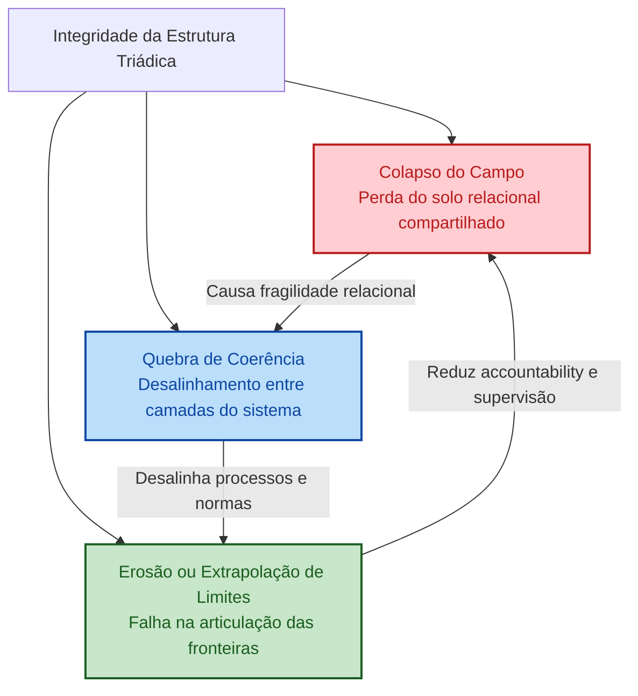

### 6.4.2 Modos de Ruptura – Versão Visual

Quando a estabilidade estrutural não é mantida, a **estrutura triádica** se torna vulnerável a modos distintos de ruptura. Estes surgem como **processos graduais, relacionais e sistêmicos** que corroem governabilidade, inteligibilidade e accountability.

| **Modo de Ruptura** | **Descrição** | **Exemplos em sistemas híbridos humano–IA** | **Efeitos na Governança** |
|------------------------|----------------|-----------------------------------------------|-------------------------------|
| **Colapso do Campo** | Perda do solo relacional compartilhado; atores perdem referência comum. | Opacidade em decisões; redistribuição assimétrica de agência; mudanças institucionais não acompanhadas por atualização do quadro interpretativo. | Decisões contestadas ou mal interpretadas; mecanismos formais tornam-se ineficazes; enfraquece construção coletiva de sentido. |
| **Quebra de Coerência** | Desalinhamento entre dimensões temporais, funcionais ou normativas; campo parcialmente intacto. | Desalinhamento temporal: processos automatizados rápidos demais; funcional: conflito com papéis ou procedimentos; normativo: valores éticos dissociados do comportamento real. | Cadeias decisórias opacas; resultados inconsistentes; difusão de responsabilidade; confiança e legitimidade corroídas. |
| **Erosão/Extrapolação de Limites** | Falha na articulação e operação das fronteiras estruturais. | Erosão: adiamento ou diluição da responsabilidade, dependência de sistemas automatizados.  Extrapolação: limites rígidos, proliferação de regras sem integração ao campo relacional. | Limites deixam de ser generativos; suprimem julgamento contextual; inibem aprendizado; conformidade performativa; accountability enfraquecida. |

**Padrão estrutural comum:**  
- Falha de governança surge de **desalinhamentos progressivos** na tríade.  
- Colapso do campo compromete o solo relacional.  
- Quebra de coerência desorganiza inteligibilidade entre camadas.  
- Falhas de limites dissolvem responsabilidade e accountability.  
- Os modos tendem a **reforçar-se mutuamente**, gerando efeitos em cascata.

**Conclusão:**  
Para sistemas híbridos humano–IA, a governança eficaz requer **atenção contínua à integridade da estrutura triádica**, não apenas ao desempenho técnico ou conformidade formal.

# Modos de Ruptura da Estrutura Triádica

### Explicação Visual:

- **Colapso do Campo (vermelho)**: indica a perda do solo relacional compartilhado, levando a fragilidade na coordenação e inteligibilidade.
- **Quebra de Coerência (azul)**: representa o desalinhamento entre camadas temporais, funcionais ou normativas, gerando decisões opacas e inconsistentes.
- **Erosão ou Extrapolação de Limites (amarelo)**: falha na articulação das fronteiras, causando difusão de responsabilidade e perda de governabilidade.

**Setas de interdependência:**  
Cada modo de ruptura influencia os demais, criando **ciclos de retroalimentação** que podem intensificar a fragilidade sistêmica.

