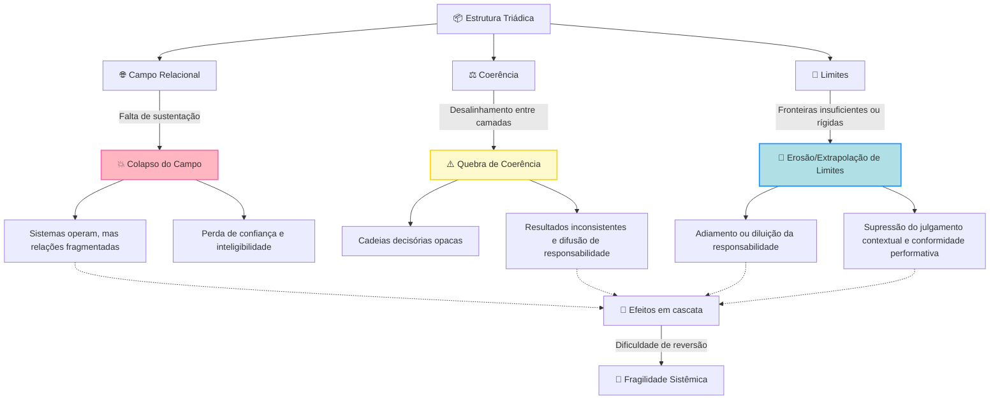
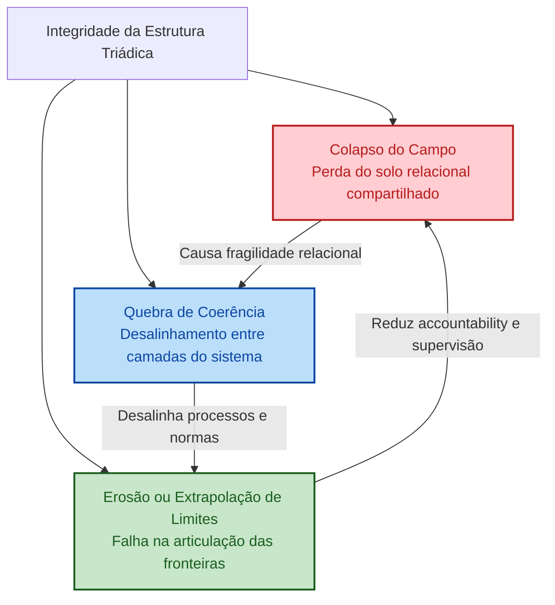
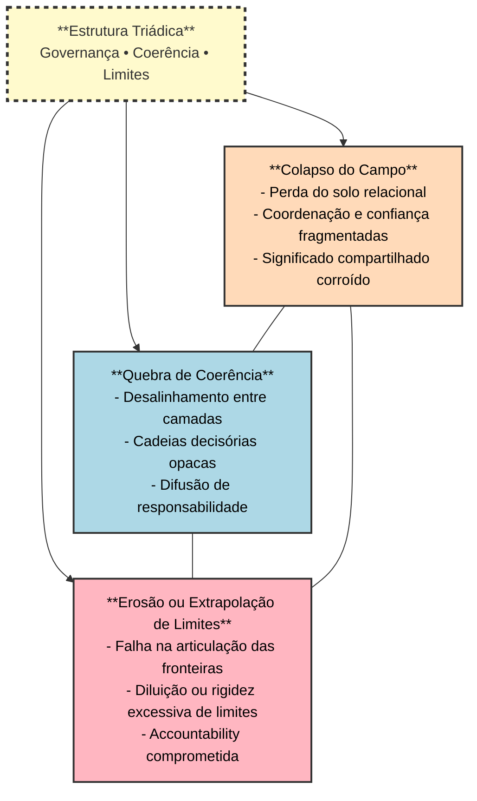
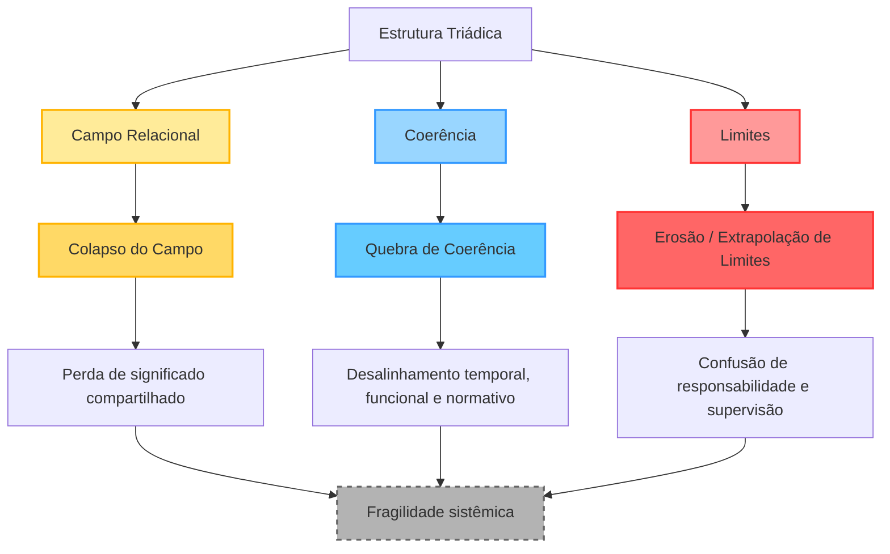
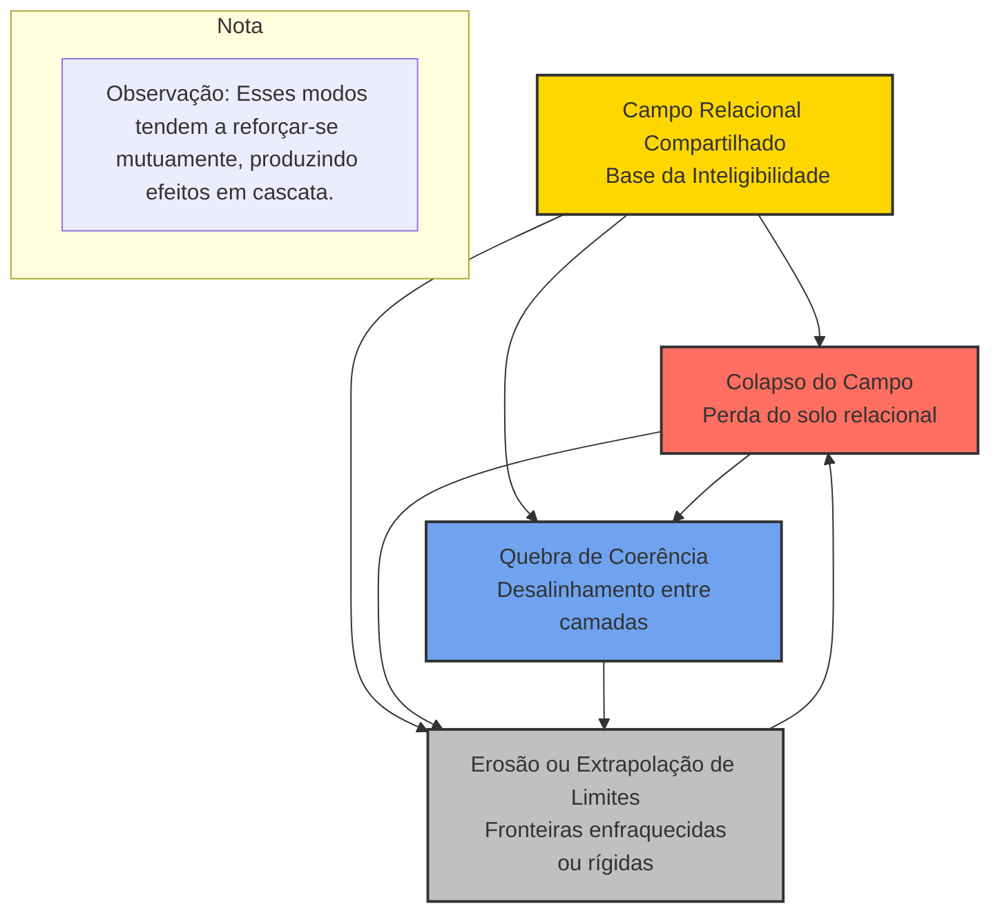

### 6.4.2 Modos de Ruptura – Versão Visual

Quando a estabilidade estrutural não é mantida, a **estrutura triádica** se torna vulnerável a modos distintos de ruptura. Estes surgem como **processos graduais, relacionais e sistêmicos** que corroem governabilidade, inteligibilidade e accountability.

| **Modo de Ruptura** | **Descrição** | **Exemplos em sistemas híbridos humano–IA** | **Efeitos na Governança** |
|------------------------|----------------|-----------------------------------------------|-------------------------------|
| **Colapso do Campo** | Perda do solo relacional compartilhado; atores perdem referência comum. | Opacidade em decisões; redistribuição assimétrica de agência; mudanças institucionais não acompanhadas por atualização do quadro interpretativo. | Decisões contestadas ou mal interpretadas; mecanismos formais tornam-se ineficazes; enfraquece construção coletiva de sentido. |
| **Quebra de Coerência** | Desalinhamento entre dimensões temporais, funcionais ou normativas; campo parcialmente intacto. | Desalinhamento temporal: processos automatizados rápidos demais; funcional: conflito com papéis ou procedimentos; normativo: valores éticos dissociados do comportamento real. | Cadeias decisórias opacas; resultados inconsistentes; difusão de responsabilidade; confiança e legitimidade corroídas. |
| **Erosão/Extrapolação de Limites** | Falha na articulação e operação das fronteiras estruturais. | Erosão: adiamento ou diluição da responsabilidade, dependência de sistemas automatizados. <br>Extrapolação: limites rígidos, proliferação de regras sem integração ao campo relacional. | Limites deixam de ser generativos; suprimem julgamento contextual; inibem aprendizado; conformidade performativa; accountability enfraquecida. |

**Padrão estrutural comum:**  
- Falha de governança surge de **desalinhamentos progressivos** na tríade.  
- Colapso do campo compromete o solo relacional.  
- Quebra de coerência desorganiza inteligibilidade entre camadas.  
- Falhas de limites dissolvem responsabilidade e accountability.  
- Os modos tendem a **reforçar-se mutuamente**, gerando efeitos em cascata.

**Conclusão:**  
Para sistemas híbridos humano–IA, a governança eficaz requer **atenção contínua à integridade da estrutura triádica**, não apenas ao desempenho técnico ou conformidade formal.


## Modos de Ruptura na Estrutura Triádica (Visual)




### Explicação Visual:

- **Colapso do Campo (vermelho)**: indica a perda do solo relacional compartilhado, levando a fragilidade na coordenação e inteligibilidade.
- **Quebra de Coerência (azul)**: representa o desalinhamento entre camadas temporais, funcionais ou normativas, gerando decisões opacas e inconsistentes.
- **Erosão ou Extrapolação de Limites (verde)**: falha na articulação das fronteiras, causando difusão de responsabilidade e perda de governabilidade.

💡 **Setas de interdependência:**  
Cada modo de ruptura influencia os demais, criando **ciclos de retroalimentação** que podem intensificar a fragilidade sistêmica.

---


# Modos de Ruptura da Estrutura Triádica




### Explicação Visual:

- **Colapso do Campo (vermelho)**: indica a perda do solo relacional compartilhado, levando a fragilidade na coordenação e inteligibilidade.
- **Quebra de Coerência (azul)**: representa o desalinhamento entre camadas temporais, funcionais ou normativas, gerando decisões opacas e inconsistentes.
- **Erosão ou Extrapolação de Limites (verde)**: falha na articulação das fronteiras, causando difusão de responsabilidade e perda de governabilidade.

💡 **Setas de interdependência:**  
Cada modo de ruptura influencia os demais, criando **ciclos de retroalimentação** que podem intensificar a fragilidade sistêmica.


---




### Como funciona este diagrama:

* O **bloco central** representa a **Estrutura Triádica**.
* Cada **modo de ruptura** é um bloco colorido ligado à triade.
* As linhas tracejadas entre os modos indicam que **os modos se reforçam mutuamente**, produzindo efeitos em cascata.
* As cores ajudam a diferenciar rapidamente cada tipo de ruptura:

  * Laranja (Campo), Azul (Coerência), Rosa (Limites).

---



### 💡 Como funciona este diagrama:

* **Estrutura triádica** é a base do sistema: Campo, Coerência e Limites.
* Cada elemento da tríade pode gerar um modo de ruptura se não for sustentado: Colapso do Campo, Quebra de Coerência, Erosão/Extrapolação de Limites.
* Cada modo de ruptura produz impactos concretos no sistema, culminando na **fragilidade sistêmica**, que é o efeito final da falha integrada da tríade.
* As cores ajudam a diferenciar os componentes e suas rupturas.

---



### Como interpretar:

* **Campo Relacional Compartilhado**: é a base da triádica — significado compartilhado, coordenação, confiança.
* **Colapso do Campo**: ocorre quando o solo relacional se fragmenta.
* **Quebra de Coerência**: desalinhamento entre camadas temporais, funcionais e normativas.
* **Erosão/Extrapolação de Limites**: falha na articulação das fronteiras, podendo diluir ou rigidificar regras e responsabilidades.
* As setas mostram **interdependência e reforço mútuo** entre os modos de ruptura.

---

### 7.4.2 Modos de Ruptura — Versão Super-Avançada (Visual)

```mermaid
flowchart TD
    A[**Estrutura Triádica**] --> B[**Colapso do Campo**]
    A --> C[**Quebra de Coerência**]
    A --> D[**Erosão ou Extrapolação de Limites**]

    B --> B1[Perda do solo relacional compartilhado]
    B --> B2[Opacidade nos processos decisórios]
    B --> B3[Fragmentação de confiança e coordenação]
    B --> B4[Governança sistêmica enfraquecida]

    C --> C1[Desalinhamento temporal]
    C --> C2[Desalinhamento funcional]
    C --> C3[Desalinhamento normativo]
    C --> C4[Cadeias decisórias opacas e difusão de responsabilidade]

    D --> D1[Erosão de limites: adiamento ou diluição de responsabilidade]
    D --> D2[Extrapolação de limites: rigidez excessiva ou regras desconectadas do contexto]
    D --> D3[Supressão de julgamento contextual e aprendizagem]
    D --> D4[Accountability fragilizada]

    style A fill:#fefbd8,stroke:#333,stroke-width:2px
    style B fill:#fcd5ce,stroke:#333,stroke-width:1px
    style C fill:#dcedc2,stroke:#333,stroke-width:1px
    style D fill:#cfe0e8,stroke:#333,stroke-width:1px
    style B1 fill:#ffebee
    style B2 fill:#ffebee
    style B3 fill:#ffebee
    style B4 fill:#ffebee
    style C1 fill:#e8f5e9
    style C2 fill:#e8f5e9
    style C3 fill:#e8f5e9
    style C4 fill:#e8f5e9
    style D1 fill:#e3f2fd
    style D2 fill:#e3f2fd
    style D3 fill:#e3f2fd
    style D4 fill:#e3f2fd

    classDef header fill:#fefbd8,stroke:#333,stroke-width:2px,font-weight:bold;
````

#### 🔹 Como ler o diagrama:

1. **Estrutura Triádica (A)**: O núcleo do sistema, sustentando governabilidade, inteligibilidade e accountability.
2. **Colapso do Campo (B)**: Ruptura relacional — quando o solo compartilhado de significado e confiança se perde.
3. **Quebra de Coerência (C)**: Ruptura de alinhamento entre camadas — processos e normas deixam de operar de forma coerente.
4. **Erosão ou Extrapolação de Limites (D)**: Ruptura de fronteiras — limites institucionais ou técnicos falham em delimitar responsabilidade e supervisionar ações.

Cada bloco mostra **efeitos progressivos e interdependentes**, enfatizando como falhas na estrutura triádica são cumulativas e reforçam-se mutuamente.

---

